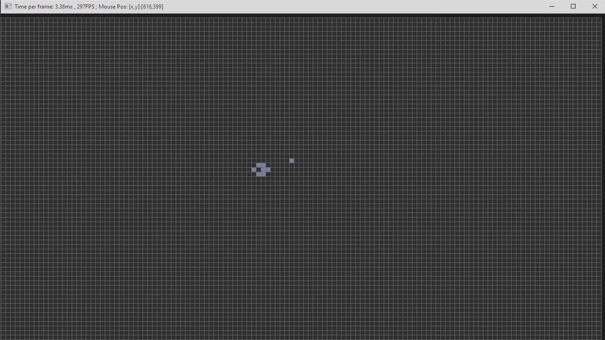

# Infinity Automata 
A little infitnite-grid cellular automata engine
Features:
  1.Software Renderer
  2.Threaded grid processing 
  3.Infinite grid (cells are int64 positions)
  
Note: Currently runs an infinite version of Conway's GOF.

